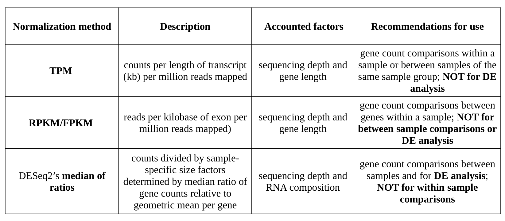

# 


Welcome to this Shiny application of [BF2I](https://bf2i.insa-lyon.fr/  ) allowing the visualization of RNA-seq data of the pea aphid *Acyrthosiphon pisum*.  
The Shiny app is coded in [R](https://www.r-project.org/ ) and allows the visual comparison of the pea aphid's gene expression.


## Database

The database comes from transcriptomic studies conducted by the laboratory and from data published on NCBI SRA. These sequences were processed with the following tools : 
- NCBI SRA libraries were downloaded using fasterq-dump from the SRA Toolkit v2.10.8 
``` with --skip-technical and --split-3 options ```
- Reads were then pre-processed using Trimmomatic v0.39 with the following options: 
``` LEADING:20 TRAILING:20 AVGQUAL:25 SLIDINGWINDOW:10:30 MINLEN:35 ```
- Trimmed reads were mapped against *Acyrthosiphon pisum*'s genome assembly (GCF_005508785.1) using STAR v2.7.1 
``` with the "--outSAMtype BAMSortedByCoordinate --outFilterMultimapNmax 20 --outMultimapperOrder Random --outFilterMismatchNmax 5" options ```
- Mapped reads were then counted using HTseq-count v0.11.2 with the following options: 
```-f bam -r pos -t CDS -i gene_id -s no ```


## Input data

The *Input data* panel allows you to choose the samples you want to visualize.
The choice of the samples to visualize can be done independantly on two different levels:

1. From the database  
The table allows you to easily visualize the content of the *htseq_database_design.tsv* file.
You can select your samples of interest via this table by clicking on the rows associated with these samples.

2. From your own data
You can also import your own datasets to visualize them independantly or compare them with the database. 
In order to take full advantage of the visualization possibilities, we invite you to upload a design file for your own data as well.
An example of a good design file is available in the *my_data_ex* folder.

**IMPORTANT**  
Regarding the formatting of your counting files:  
  - 2 columns: gene and read counts (without header)  
  - 1 line = 1 gene  
  - Gene names must match the genes in the *data/feature_size/gene_information.tab* file.

You can check the formatting of your count files by running: 
```
pip3 install pandas ##if you don't own the *pandas* library
./check_data.py  --directory ../../my_data_ex/countFiles
```

Regarding the design file of your samples:  
- Make sure to follow the formatting (number and column name) of the *my_data_ex/design_my_data.tsv* file
- fill it with as much information as possible.

You can check the formatting of your count files and design file by running:
```
pip3 install pandas ##if you don't own the *pandas* library
./check_data.py --design ../../my_data_ex/design_my_data.tsv --directory ../../my_data_ex/countFiles
```


## Visualization

Data quality assessment and quality control (i.e. the removal of insufficiently good data) are essential steps of any data analysis. These steps should typically be performed very early in the analysis of a new data set, preceeding or in parallel to the differential expression testing.
So, as a first approach, you have to look in particular for samples whose experimental treatment suffered from an anormality that renders the data points obtained from these particular samples detrimental to our purpose.

Once the quality control has been performed, you can optimally compare the samples with each other globally or focus on particular genes.

1. PCA  
The Principal Component Analysis plot of the samples shows the samples in the 2D plane spanned by their first two principal components. This type of plot is useful for visualizing the overall effect of experimental covariates and batch effects.

2. Tree  
The tree plot of the samples shows the hierarchical clustering of the samples. It allows you to detect an aberration in the clustering and maybe remove a strange sample for the analyse.

3. Counts matrix  
You can visualize the gene counts directly in the application by selecting the genes from the "Choose your gene" field or from one or more annotations of interest from the "Choose your annotation" field. Note that by choosing an annotation, you will then visualize all the genes associated with this annotation.

4. Heatmap  
To explore a count matrix, it is often instructive to look at it as a heatmap. A heatmap gives us an overview over similarities and dissimilarities between genes from samples selected. As for **Counts matrix** you can choose your genes directly, or from the annotation.

5. Barplot  
You can also view the counts per gene and per sample in a barplot to visually compare the expression levels of the selected genes.

6. Time series  
Finally, you can perform temporal monitoring of gene expression levels.  
The available libraries for this graph are those with a non-zero *dev_stage* field in the *data/htseq_database_design.tsv* file.  
Your uploaded samples will therefore be available for this visualization only if the *dev_stage* field in the *my_data_ex/design_my_data.tsv* file is non-zero.  
Thanks to the user interface, you can order the development stage labels on the x-axis of the graph.


## Normalization

Count normalization is necessary to make accurate comparisons of gene expression between samples.
The counts of mapped reads for each gene is proportional to the expression of RNA (“interesting”) in addition to many other factors (“uninteresting”). Normalization is the process of scaling raw count values to account for the “uninteresting” factors. In this way, the expression levels are more comparable between and/or within samples.

In our application you can normalize with TPM, RPKM or with DESeq2's median of ratios method.




## Admin

To expand the database, you can add new count files in the *data/htseq_database_design* folder.
Don't forget to fill in these new files in the design file of *htseq_database_design.tsv*, or else these new count datasets will not be accessible in the application.
To check that your new files respect the formatting of the database, go in the *src/py_data_format_check* folder and run:
```
pip3 install pandas ##if you don't own the *pandas* library
./check_data.py --design ../../data/htseq_database_design.tsv --directory ../../data/htseq_database
```


### Authors
This project was carried out by students of the Master of Bioinformatics in Lyon.
 - Arnaud DUVERMY (arnaud.duvermy@etu.univ-lyon1.fr)

 - Maud FERRER (maud.ferrer@etu.univ-lyon1.fr)

 - Romuald MARIN (romuald.marin@etu.univ-lyon1.fr)
